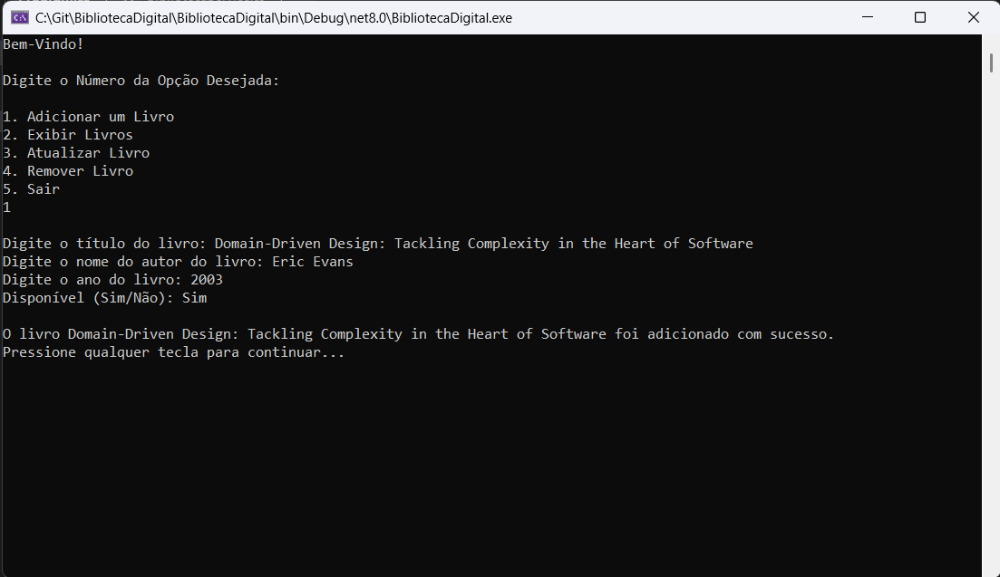
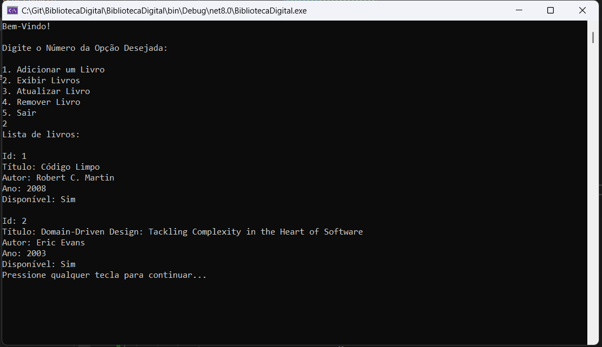
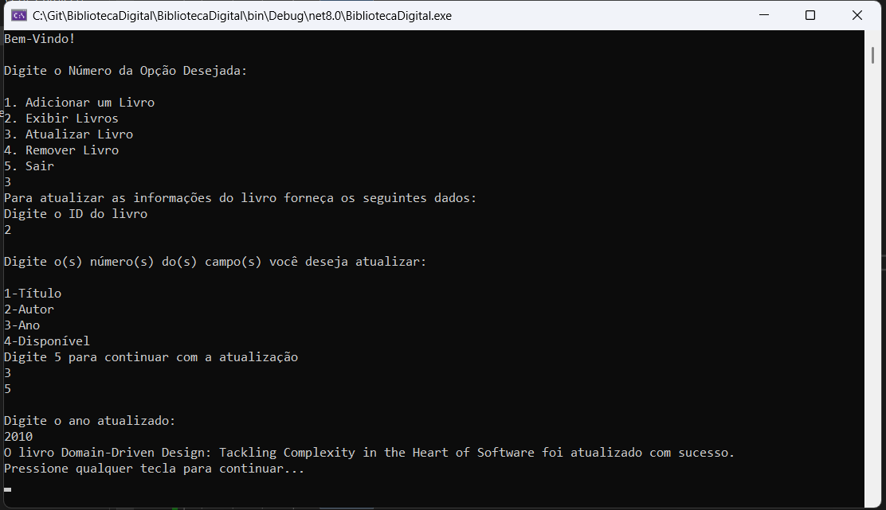
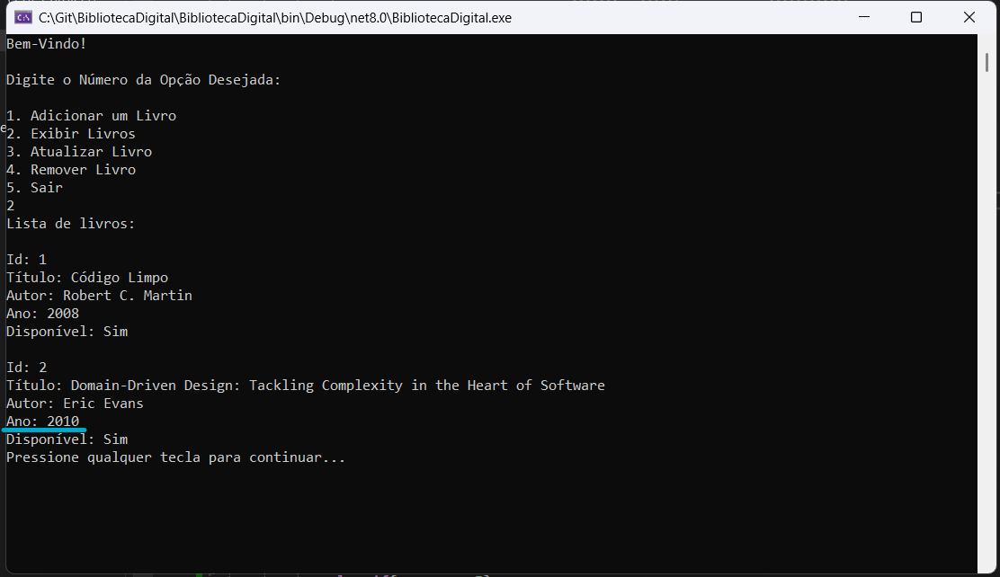
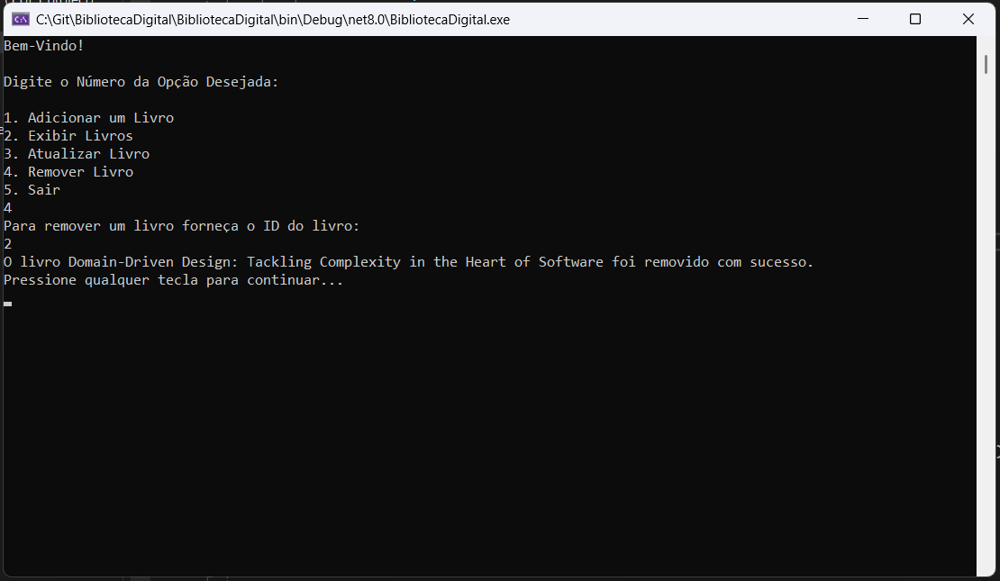
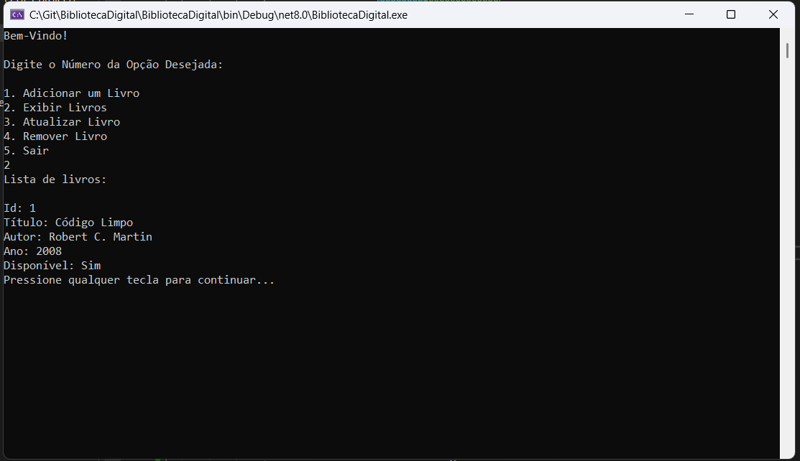
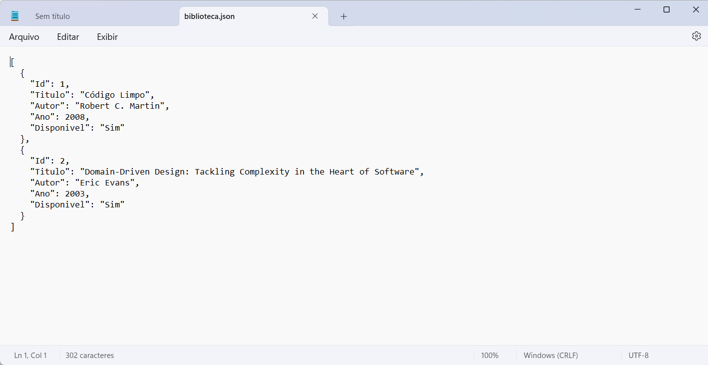

1-Biblioteca Digital

Um sistema simples de gerenciamento de livros feito em **C# .NET** como Console Application.  
Os livros são armazenados em **JSON**, garantindo persistência dos dados.

2-Funcionalidades

- Adicionar Livros

- Listar Livros

-Atualizar um Livro

- Remover Livros

- Salvar e carregar dados automaticamente via JSON

3-Tecnologias Utilizadas

- C# .NET
- System.Text.Json (para salvar os dados)
- Console Application